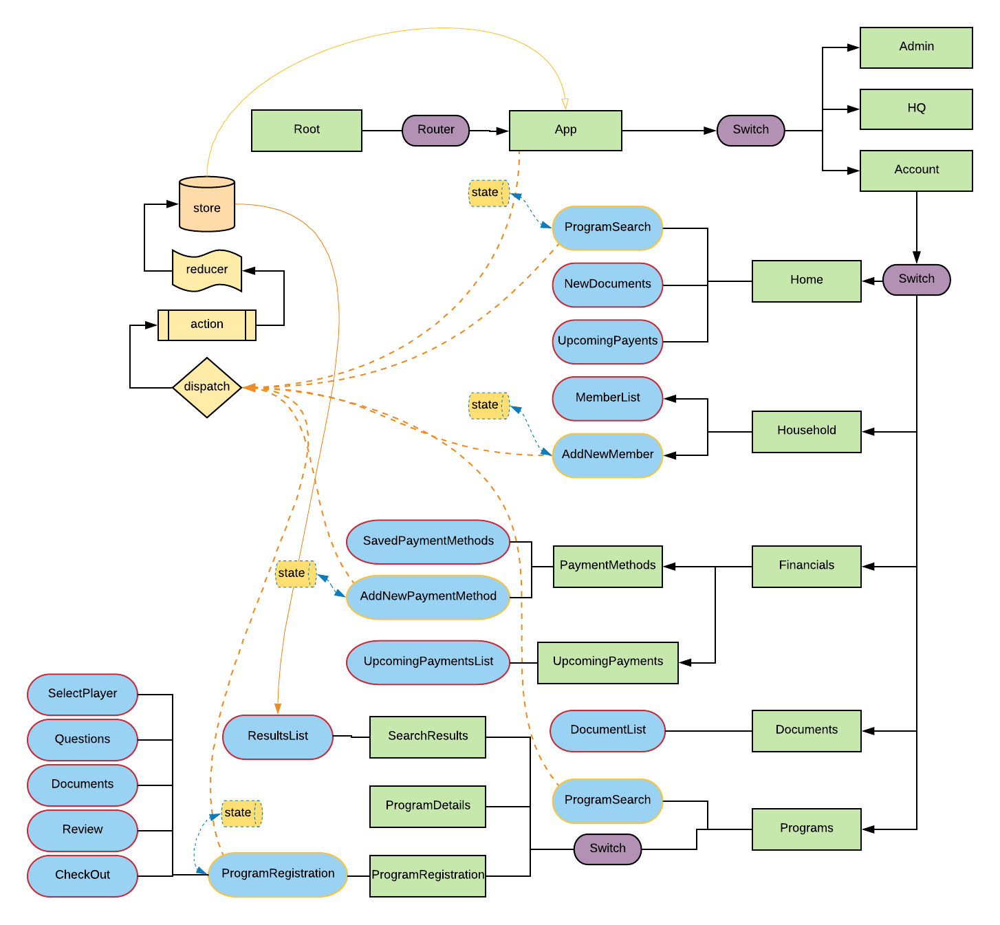

### Details

tools:
  node version manager
  gulp

libraries:
  react
  react-router
  semantic-ui
  sementic-ui-react

Node Version 

#### File Structure
```
js
  |_ actions/           ( redux actions and dispatchers )
  |_ Components/        ( data components )
  |    |_ admin/
  |    |_ account/
  |    |_ common/
  |    |_ hq/
  |_ constants/         ( static data values)
  |_ images/
  |_ Pages/             ( view components )
  |    |_ account/
  |    |_ admin/
  |    |_ hq/
  |_ reducers/          ( redux reducers )
  |_ store/             ( redux store )
  |_ style/             ( dist folder for semantic-ui)
  |_ App.js             ( main components)
  |_ index.js           ( main component wrapper | renders app to DOM node )
  |_ utilities.js       ( common tools )
```


#### Account Component Overview

0